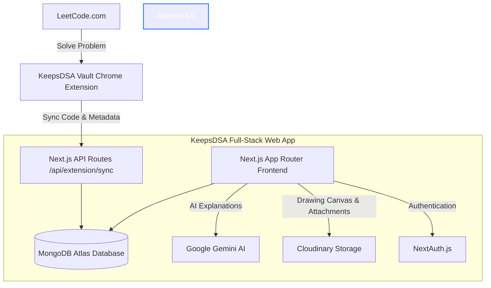

# 🌌 KeepsDSA
> **Your Technical Second Brain for Data Structures & Algorithms**
> 
> A full-stack Next.js developer vault and automated Chrome companion designed to shift your DSA learning from blind grinding to systematic pattern mastery.

---

## ⚡ Overview
**KeepsDSA** is a comprehensive DSA tracking, revision, and analysis workbench. Instead of forgetting solutions or storing messy local scratch files, KeepsDSA lets you sync problems directly from LeetCode, save multi-solution approaches (Brute-Force vs. Optimal) side-by-side, analyze time/space complexities, write rich math-supported explanations, sketch layouts on an digital drawing canvas, and review them using the **SuperMemo-2 Spaced Repetition Algorithm**.

---

## 🛠️ System Architecture



---

## ✨ Core Features

### 🔌 1. KeepsDSA Vault Chrome Extension
* **Full-Code Grabber:** Overcomes default clipboard limitations by executing inside the LeetCode runtime context (`world: 'MAIN'`) to scrape the complete contents of both Monaco and CodeMirror editors.
* **Auto-Language Detection:** Resolves and maps the active editor language automatically before syncing.
* **Seamless API Syncing:** Transports problem details, difficulty, categories, code, and user solution details directly into your vault with a single click.

### 📚 2. Multi-Approach Solutions Workspace
* **Side-by-Side Comparison:** Track **Brute-Force**, **Better**, and **Optimal** solutions.
* **Complexity Fields:** Explicit selectors for Time Complexity and Space Complexity per solution (e.g., $O(1)$, $O(N)$, $O(N \log N)$).
* **Monaco Editor Interface:** Rich, syntax-highlighted code viewer powered by Monaco Editor.

### ⏳ 3. SuperMemo-2 Spaced Repetition
* **SM-2 Algorithm Integration:** Automates your revision queue. Recommends the next review intervals (in days) and adjusts the *Ease Factor* ($EF$) based on your custom confidence rating (1–5).
* **Revision Dashboard:** Keep track of which patterns or algorithms need immediate practice.

### 📝 4. Rich Visual Workspaces
* **KaTeX LaTeX Markdown:** Write algorithms with clean LaTeX math formatting (e.g. state-transitions in DP or tree structures).
* **Whiteboard & Sketch Pad:** Built-in drawing pad using `react-sketch-canvas`. Scribble layouts, draw arrays/graphs with pointer devices, and save diagrams directly to the problem scope.
* **10MB Cloudinary Uploader:** Upload handdrawn notes, screenshots, or reference PDFs (supports files up to 10MB).

### 🤖 5. Gemini AI Code Explainer
* **Context-Aware Explanations:** Highlight confusing lines of code or complex solution logic to ask the integrated Gemini model for optimization tips or clear breakdowns.

### 📊 6. Analytics & Gamification
* **GitHub-Style Contribution Graph:** Tracks daily problem-solving consistency.
* **Category Breakdown:** Chart distributions of your solved topics (e.g. Dynamic Programming, Graphs, Arrays).
* **Badge System:** Earn achievements like *First Blood*, *Consistent* (7-day streak), *Unstoppable* (30-day streak), *Graph Master*, *DP Master*, and *Heavy Hitter* (10 Hard solved).

---

## 📂 Project Structure

```text
keepsdsa/
├── src/
│   ├── app/                      # Next.js App Router
│   │   ├── (marketing)/          # Landing & demo pages
│   │   ├── (app)/                # Main Dashboard, workspaces, profiles, settings
│   │   └── api/                  # Auth, extension sync, upload, & chat API routes
│   ├── components/               # UI components, notes, canvas & panels
│   │   ├── ui/                   # High-end design system primitives
│   │   └── layout/               # Sidebar (with auto-hover trigger), navbar
│   ├── models/                   # Mongoose schemas (User, Problem, Solution, Upload)
│   └── lib/                      # Helper libraries (sm2.ts, badges.ts, dbConnect.ts)
│
├── extension/                    # Vite + CRXJS Chrome Extension src
│   ├── src/                      # Popup screens & content scripts
│   ├── manifest.json             # Extension manifest (MV3)
│   └── vite.config.ts            # Vite compiler configuration
│
└── public/                       # Static assets & pre-packaged extension zip
```

---

## 🚀 Getting Started

### 📋 Prerequisites
* **Node.js** (v18.x or above)
* **MongoDB** instance (Atlas URI or local server)
* **Cloudinary** Account (for note & diagram media storage)
* **Gemini AI API Key** (for code assistant actions)

---

### 💻 1. Web Application Setup

1. **Clone the repository** and navigate to the root directory:
   ```bash
   git clone https://github.com/RohanishR/KeepsDSA.git
   cd KeepsDSA
   ```

2. **Install dependencies**:
   ```bash
   npm install
   ```

3. **Configure Environment Variables**:
   Create a `.env.local` file by copying the template:
   ```bash
   cp .env.example .env.local
   ```
   Provide the following parameters:
   ```env
   # Database connection
   MONGODB_URI="mongodb+srv://..."

   # NextAuth
   # Create a secure secret: openssl rand -base64 32
   AUTH_SECRET="your_nextauth_secret"
   NEXTAUTH_URL="http://localhost:3000"

   # NextAuth Google OAuth
   AUTH_GOOGLE_ID="your_google_client_id"
   AUTH_GOOGLE_SECRET="your_google_client_secret"

   # Cloudinary configuration
   NEXT_PUBLIC_CLOUDINARY_CLOUD_NAME="your_cloud_name"
   CLOUDINARY_API_KEY="your_api_key"
   CLOUDINARY_API_SECRET="your_api_secret"

   # Gemini API Key for AI chat
   GEMINI_API_KEY="your_gemini_api_key"
   ```

   > [!IMPORTANT]
   > Ensure that **Cloudinary** delivers PDF files by navigating to **Cloudinary Console > Settings > Security** and enabling **"Allow delivery of PDF and ZIP files"**.

4. **Run the local server**:
   ```bash
   npm run dev
   ```
   Open [http://localhost:3000](http://localhost:3000) to view the application.

---

### 🔌 2. Chrome Extension Installation

#### Option A: Quick Install (Precompiled)
1. Navigate to your KeepsDSA local workspace directory.
2. Locate `keepsdsa-extension.zip` in the `public/` directory and extract it.
3. Open your browser and go to `chrome://extensions/`.
4. Enable **Developer Mode** (toggle on the top right).
5. Click **Load unpacked** on the top left and select the extracted folder.

#### Option B: Build from Source
1. Navigate to the extension folder:
   ```bash
   cd extension
   ```
2. Install extension package managers:
   ```bash
   npm install
   ```
3. Compile the production package:
   ```bash
   npm run build
   ```
4. Open `chrome://extensions/` and click **Load unpacked**.
5. Select the newly generated `extension/dist/` directory.

#### Linking the Extension:
1. Log into your dashboard at `http://localhost:3000`.
2. Go to **Settings** or **Profile** and generate your **Sync Token**.
3. Open the **KeepsDSA Vault Chrome Extension** popup from the browser toolbar.
4. Input the URL (`http://localhost:3000`) and paste your **Sync Token** to authenticate.
5. Solve problems on LeetCode and click the Extension icon to sync immediately!

---

## 🎨 Design System & Aesthetics
KeepsDSA is built with a premium glassmorphic aesthetic focusing on developer comfort:
* **Background:** Deep slate dark canvas (`#070708`).
* **Visuals:** Ambient glow grids, spotlight card animations (`SpotlightCards`), and smooth page transitions.
* **Sidebar:** Sleek navigation menu with auto-hover interactions and responsive auto-hiding behavior for smaller screen dimensions.

---

🤝 Contributing

Contributions, issues, and feature requests are welcome.

Feel free to fork the repository and submit a pull request.

## 🛡️ License
Distributed under the MIT License. See `LICENSE` for more information.
